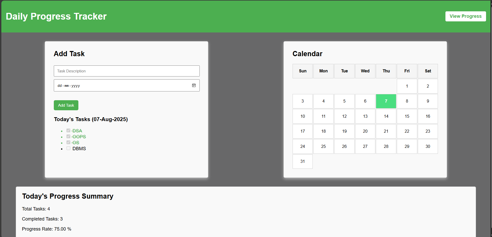

# Daily Progress Tracker

## Description  
Daily Progress Tracker is a personal productivity web application designed to help users plan and track daily tasks. It allows users to add tasks, mark them as complete or incomplete, and view progress through a user-friendly interface. The platform uses JSP, Servlets, and MySQL, ensuring data persistence and smooth task management.

## Technologies Used

- ### Java  
  Backend logic and task handling.

- ### Servlet  
  Handles HTTP requests and database operations.

- ### JSP  
  Dynamic rendering of task-related content.

- ### MySQL  
  Stores task data and progress status.

- ### Tomcat Server  
  Used to deploy and host the web application.

- ### HTML  
  Page structure and form elements.

- ### CSS  
  Styling and layout for responsiveness.

- ### JavaScript  
  Calendar interactions and minor UI behavior.

## Features

- Add daily tasks with a specific date.
- View all tasks for the selected day.
- Mark tasks as completed or incomplete.
- Visual progress bar indicating completion percentage.
- Data persistence using MySQL.
- Responsive and intuitive user interface.

## Roadmap

### Getting Started

#### Prerequisites
- Java Development Kit (JDK)
- Apache Tomcat Server
- MySQL Server
- Eclipse IDE (or any preferred Java IDE)

### Installation

1. Clone the Repository:

```bash
git clone https://github.com/sumanapanda/DailyProgressTracker.git
```

2. Open the project in your preferred IDE.

3. Configure the Tomcat server in your IDE.

4. Set up the MySQL database:

```sql
CREATE DATABASE progress_tracker;

USE progress_tracker;

CREATE TABLE tasks (
    id INT PRIMARY KEY AUTO_INCREMENT,
    task_date DATE NOT NULL,
    description VARCHAR(255),
    is_completed TINYINT(1) DEFAULT 0
);
```

> You can insert sample data if needed to visualize task status.

5. Modify the database configuration in `DBConnection.java`:

```java
String url = "jdbc:mysql://localhost:3306/progress_tracker";
String user = "your_mysql_username";
String password = "your_mysql_password";
```

6. Deploy the project on the Tomcat server.

7. Access the project in your browser:

```
http://localhost:8765/CheckMyProgress/index.jsp
```

## Folder Structure

```
DailyProgressTracker/
├── web/
│   ├── index.jsp
│   ├── addTask.jsp
│   ├── viewProgress.jsp
│   ├── style.css
│   └── script.js
├── WEB-INF/
│   ├── web.xml
│   └── classes/
│       ├── AddTaskServlet.java
│       ├── ProgressServlet.java
│       └── DBConnection.java
```

## Screenshots

### Home Page  
Displays calendar, task form, and today's task summary.  


### Progress View  
Shows progress bars based on task completion.  


### Database Table  
Backend structure showing task data.  


## Author  
Sumana Panda  
4th Year B.Tech | Information Technology  
Asansol Engineering College
